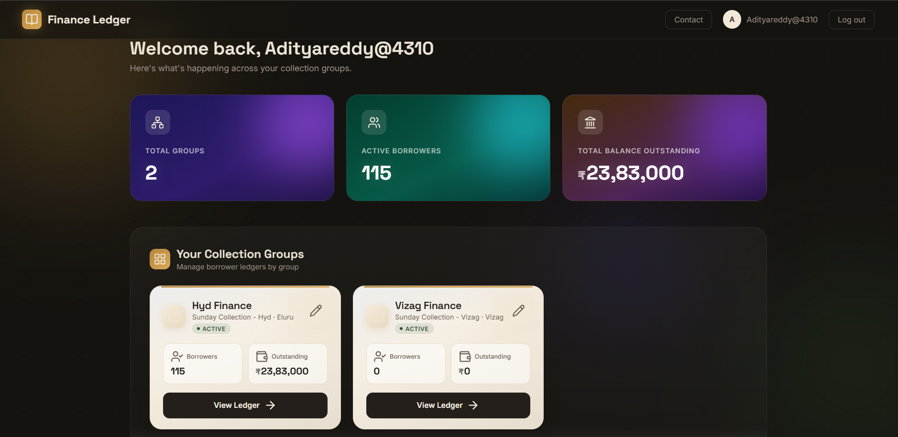
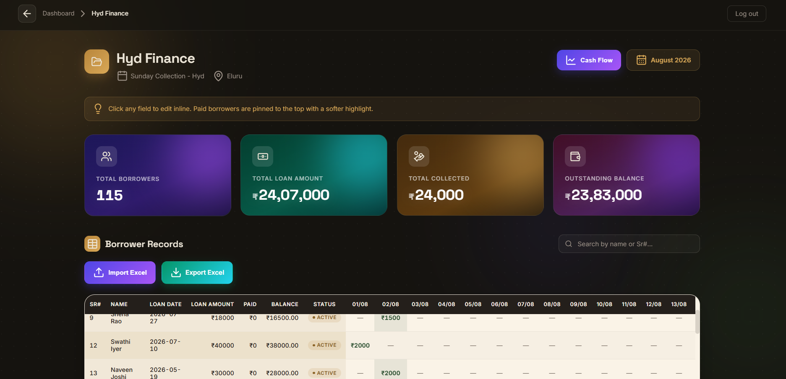
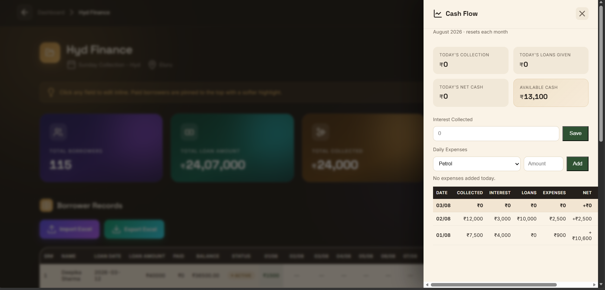
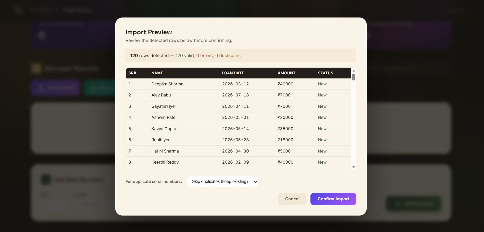

<p align="center">
  
</p>

<h1 align="center">💰 FinanceFlow</h1>

<p align="center">
Enterprise Loan Collection & Finance Management Platform
</p>

<p align="center">

Modern Django application built for small finance businesses to manage
borrowers, collections, cash flow and Excel workflows.

</p>

<p align="center">


</p>

---

## 🎥 Demo

<p align="center">


</p>

---

## ✨ Why FinanceFlow?

Many small finance companies still manage borrowers using notebooks and Excel sheets.

FinanceFlow digitizes the entire workflow into a clean web application.

It enables:

- Loan Management
- Daily Collection Tracking
- Cash Flow Monitoring
- Excel Import & Export
- Group-wise Finance Management
- Modern Dashboard
- Secure Authentication

---

## 🚀 Features

### Authentication

- Secure Login
- Registration
- Password Reset
- Session Authentication

---

### Finance Groups

- Multiple finance groups
- Independent ledgers
- Statistics
- Outstanding amount tracking

---

### Borrowers

- Add borrower
- Edit borrower
- Delete borrower
- Search borrower
- Give new loan
- Preserve history
- Paid borrower highlighting

---

### Cash Flow

- Collections
- Loans Given
- Interest
- Expenses
- Running Cash
- Monthly Summary

---

### Excel

- Bulk Import
- Validation
- Duplicate Detection
- Export Ledger

---

### Dashboard

- Modern FinTech UI
- Mobile Responsive
- Live Statistics
- Beautiful Charts

---

## 📸 Screenshots

### Dashboard



---

### Finance Group



---

### Cash Flow



---

### Excel Import



---

### Login


---


## 🏗 Tech Stack

| Layer | Technology |
|--------|------------|
| Backend | Django |
| Language | Python |
| Database | SQLite |
| Excel | openpyxl |
| Frontend | HTML CSS JavaScript |
| Authentication | Django Auth |
| Email | SMTP |
| Icons | Lucide |

---

## 📂 Project Structure

```text
FinanceFlow
│
├── core/
├── financeapp/
├── screenshots/
├── DemoVideo/
├── static/
├── templates/
├── docs/
├── requirements.txt
├── manage.py
└── README.md
````

---

## ⚙ Installation

```bash
git clone https://github.com/Adityareddy4310/FinanceFlow.git
```

```bash
cd FinanceFlow
```

```bash
python -m venv venv
```

Windows

```bash
venv\Scripts\activate
```

Linux

```bash
source venv/bin/activate
```

Install dependencies

```bash
pip install -r requirements.txt
```

Run server

```bash
python manage.py migrate
```

```bash
python manage.py runserver
```

Visit

```
http://127.0.0.1:8000/
```

---

## 📈 Roadmap

* Docker Support
* PostgreSQL
* AWS Deployment
* REST API
* Mobile App
* Reports & Analytics

---

## 🤖 AI Assisted Development

FinanceFlow was developed using an **AI-assisted development workflow (Vibe Coding)**.

I designed the product requirements, validated features, iterated on the UI/UX, tested functionality, and integrated AI-generated code into a working production-style application.

This project reflects my ability to:

* Translate business requirements into software
* Use AI development tools effectively
* Debug, customize, and integrate generated code
* Deliver complete end-to-end applications

---

## 👨‍💻 Author

**Aditya Reddy Kovvuri**

AI/ML Engineer

Graduate Apprentice @ DRDO

LinkedIn

Portfolio

GitHub

---

## ⭐ Support

If you like this project,

⭐ Star the repository.

```

